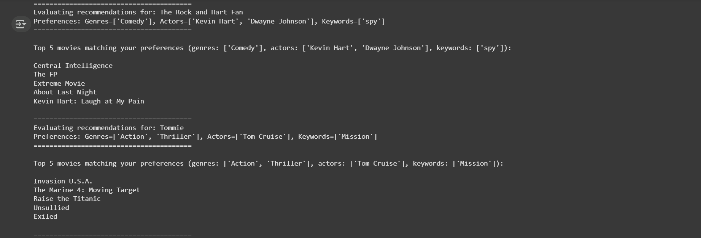

# 🎬 Movie Recommendation System  
**Content-Based Filtering + User-Based Collaborative Filtering**

A Python-based movie recommendation engine using two popular approaches:  
- **Content-Based Filtering** (recommend similar movies based on attributes like genres, cast, and plot keywords)  
- **User-Based Collaborative Filtering** (recommend movies liked by similar users)  

---

## ✨ Features
### 📌 Content-Based Filtering
- Uses **CountVectorizer** to process:
  - 🎭 Genres
  - 🎬 Cast
  - 📝 Plot keywords
- Calculates similarity with **Cosine Similarity**
- Recommends movies similar to a given movie

### 👥 User-Based Collaborative Filtering
- Builds a **user-item rating matrix**
- Uses **k-Nearest Neighbors** to find similar users
- Calculates similarity with **Cosine Similarity**
- Recommends movies liked by similar users but unseen by the target user

---

## 📊 Dataset
- **Source:** [TMDB 5000 Movie Dataset](https://www.kaggle.com/datasets/tmdb/tmdb-movie-metadata)  
- **Ratings:** `ratings.csv` with 408 ratings from 20 users  
- **Key Features Used:** Genres, Cast, Plot Keywords  

---

## 🧠 Workflow

### **Content-Based Filtering**
Movie Metadata → Text Vectorization (CountVectorizer) → Cosine Similarity → Top-N Similar Movies

### **User-Based Collaborative Filtering**
User Ratings → User-Item Matrix → k-NN → Cosine Similarity → Top-N Recommended Movies


---

## ⚙️ Installation & Usage

### 1️⃣ Clone Repository
```bash
git clone https://github.com/gaurav-1410/movie-recommendation-system.git
cd movie-recommendation-system
```

```bash
pip install -r requirements.txt
```
---

## 🎯 Output

